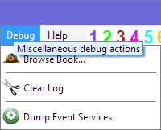
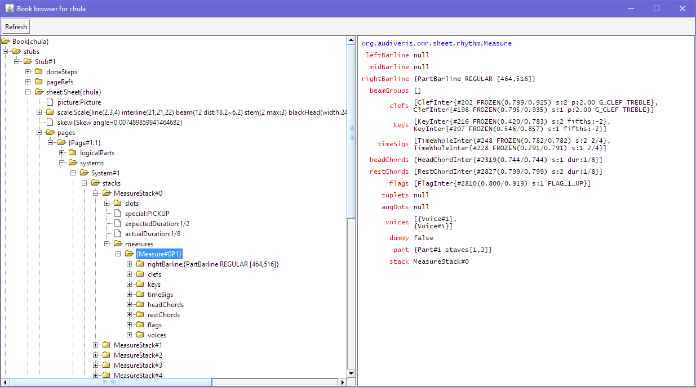

## Debug menu
{: .no_toc }



This menu makes a few debug actions conveniently available.

NOTA: The casual user can safely ignore this menu.
To make it visible, you must have beforehand selected the `DEBUG` topic in the
[Advanced Topics](../advanced/topics.md) dialog.

---
Table of contents
{: .no_toc .text-delta }

1. TOC
{:toc}
---

### Browse Book...



This dialog allows the user to browse the whole hierarchical content of the current book.

* The left part is a tree meant to navigate through the book hierarchy of sheets, pages, systems,
measures, chords, glyphs, inters, etc.

* The right part displays the name and value of each data member of the entity currently selected
in the tree.

### Clear Log

This action clears the events panel (located at bottom of main window).
This is meant for an easier focus on the coming events.

Note this does not impact the output, nor the log file.

### Dump Event Services

Dump all UI services connected to the current sheet.

A UI service is an instance of EventBus, with publish/subscribe features, which allows to decouple
UI agents.

* Typically, a glyph board will be subscribed to the bus in charge of glyph selection, in order to
display the glyph details as soon as a glyph is published on the glyph bus by some agent.
* The same glyph board also allows the user to type a glyph ID, which will be published on the glyph
ID bus, and the glyph index (subscribed on the glyph ID bus) will search its index with the ID and
publish the corresponding glyph on the glyph bus, which will be picked up by the glyph board,
among other subscribers.

For each allocated UI service (such as locationService, glyphIndexService, interIndexService),
this action lists:
* Each event class handled by the service,
* The latest instance, if any, published in the event class,
* Every agent (address and name) subscribed to this event class.

Here is an example:
```
Selection services of Stub#1
locationService subscribers:
   LocationEvent: 6 LocationEvent{ src:SymbolsEditor-MyView ENTITY_INIT java.awt.Rectangle[x=2254,y=1525,width=40,height=79]}
      @3a261e6f glyphIndexService size:973
      @2d727d16 hLagService size:2236
      @6f854dad vLagService size:3252
      @1ae6e8ef interIndexService size:771
      @22241722 SymbolsEditor-MyView
      @336ce775 filamentIndexService size:0
No pixelService
hLagService subscribers:
   IdEvent: 1
      @2d727d16 hLagService size:2236
   EntityListEvent: 2
      @2d727d16 hLagService size:2236
      @22241722 SymbolsEditor-MyView
vLagService subscribers:
   IdEvent: 1
      @6f854dad vLagService size:3252
   EntityListEvent: 2
      @6f854dad vLagService size:3252
      @22241722 SymbolsEditor-MyView
filamentIndexService subscribers:
   EntityListEvent: 1 EntityListEvent{ src:filamentIndexService PRESSING []}
      @336ce775 filamentIndexService size:0
   IdEvent: 1
      @336ce775 filamentIndexService size:0
glyphIndexService subscribers:
   IdEvent: 1 IdEvent{ src:{SymbolGlyphBoard Glyph} ENTITY_INIT 2793}
      @3a261e6f glyphIndexService size:973
   EntityListEvent: 4 EntityListEvent{ src:glyphIndexService ENTITY_INIT [BasicGlyph{#2793 [SYMBOL]} ]}
      @3a261e6f glyphIndexService size:973
      @22241722 SymbolsEditor-MyView
      @28388473 {EvaluationBoard Basic Classifier}
      @3321ce77 {SymbolGlyphBoard Glyph}
interIndexService subscribers:
   EntityListEvent: 3 EntityListEvent{ src:interIndexService PRESSING []}
      @1ae6e8ef interIndexService size:771
      @22241722 SymbolsEditor-MyView
      @220219b7 {InterBoard Inter}
   IdEvent: 1
      @1ae6e8ef interIndexService size:771
```
