## Inter editors
{: .no_toc }

This reference chapter gathers the description of all Inter editors variants,
especially regarding the role and potential move of its handles.  
It also presents the two variants (Lines and Global) of Staff editor,
even though -- strictly speaking -- a Staff is not an Inter.

---
Table of contents
{: .no_toc .text-delta }

1. TOC
{:toc}
---

### Default editor

The default editor applies to every Inter class, for example the augmentation dot class here below,
unless a more specific editor is defined for the Inter class at hand.

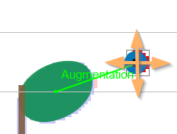

The default editor provides only one handle located at Inter center.
This very basic editor allows to move the Inter in any direction, but provides no way to resize it.

The involved relations if any -- like the "_Augmentation_" relation between the note head and the
augmentation dot in this example -- are dynamically updated while the Inter is being moved.

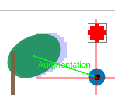
Here, we have moved the augmentation dot one line below and the relation is
kept with the augmented note.

Here, we are currently located too far from the note and the relation disappears.

The next sections describe all specific editors, listed in alphabetical order.

### Barline/Bracket editor

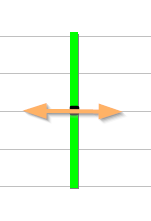

A Barline can move only horizontally, and can't be resized, because it is **snapped** to
staff height.

(In Audiveris data model, a Barline goes from staff top line to staff bottom line.
Aligned barlines from different staves are often connected by so-called "Connectors").

The same editor applies to Bracket as well.

### Brace editor

* Center handle shifts the brace in any direction,
* Top and bottom handles resize the brace vertically.

IMPORTANT NOTICE: Shifting or resizing a brace is meant for small adjustments only.  
If you want to extend or reduce the number of staves embraced by a Brace instance
(which is a rather heavy operation that impacts the definition of parts within a system),
this must be done **explicitly** by adding or removing a manual Brace.
Please refer to [Part merge](part.md) section for such Brace usage.

### Beam editor

* Center handle moves the whole beam in any direction.
* A side handle moves the side in any direction, **snapping** the beam side on any stem nearby.

### Ending editor

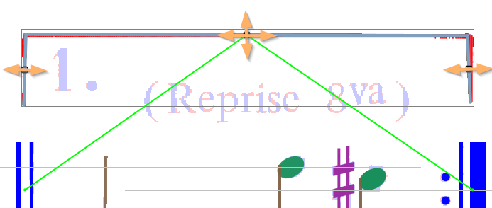

* Center handle moves the whole ending in any direction
* A side handle moves the ending side horizontally
(together with its side leg if any)

### Flag editor

The flag editor is another variation of the default editor with its single center handle,
which here can move **only vertically** along the related stem.

### Head editor

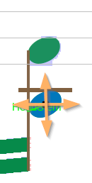

The note head editor is similar to the default editor, with its single center handle.
The only difference is that the head being moved is snapped:
* **Vertically** to the underlying staff lines, or ledger lines
  (perhaps dynamically created while head is shifted away from staff),
* **Horizontally** to the stem nearby, if any, on left or right.
Of course, this does not apply to WHOLE or BREVE shapes since these heads use no stem.

### KeyAlter/Key editor

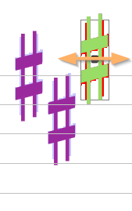

The key alter editor allows to move **horizontally** one KeyAlter member of the key signature.

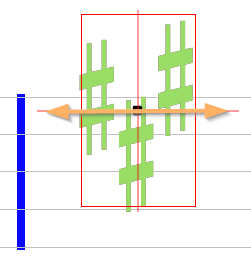

If the key signature is a whole manual signature (e.g. it has been dropped from the ShapePalette),
then the editor can shift the **whole key** horizontally.

### TimeHalf/Time editor

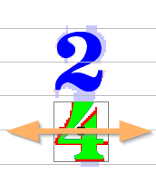

If the time signature was recognized with two separate halves, each of these halves is an inter
by itself, and can be shifted horizontally only.

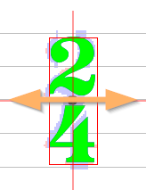

If the time signature is a whole signature then is can be shifted horizontally as a whole.

Note this applies as well to signatures handled globally, such as a manual custom signature
or even a two-part signature (such as 2/4) if it was recognized globally.

### Ledger editor

### Octave shift editor

These are the 3 handles available for a simple octave shift.

But more complex actions are possible.   
Please refer to the dedicated [Octave shift Edition](octave_shift.md#edition) section.

### Slur editor
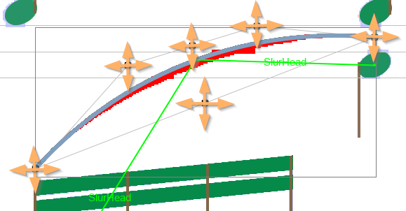

This is the most complex editor:
* Center handle shifts the whole slur in any direction,
* A side handle extends the slur side in any direction
  (together with the related control point),
* Control handles move their underlying control point,
* Middle of control segment moves both control points in any direction.

### Staff lines editor

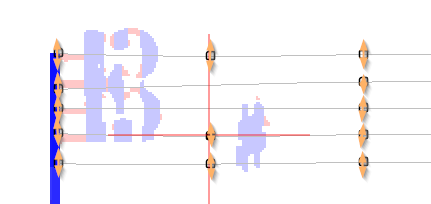

All the various lines handles in staff are available for individual vertical dragging.

See Staff Edition [Lines mode](staff_editor.md#lines-mode).

### Staff global editor

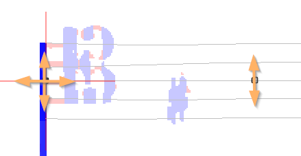

Handles are located on the staff middle line but they work for all lines as a whole
(all lines are kept parallel when a handle is moved):
* Side handles (left and right) can be dragged both vertically and horizontally, thus allowing
 to stretch or shrink the staff.
* Non-side handles can be dragged only vertically.

See Staff Edition [Global mode](staff_editor.md#global-mode).

### Stem/Arpeggiato/Connector editor

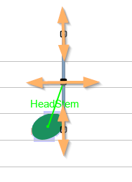

The editor applies to Stem as well as Arpeggiato and Connector (of barlines or brackets)

### Wedge editor

The handle on the lower segment allows to increase or decrease the wedge vertical spread.

### Word editor

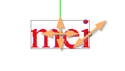

* Center handle shifts the word in any direction,
* Right handle modifies the word dimensions, by increasing or decreasing the font size.
